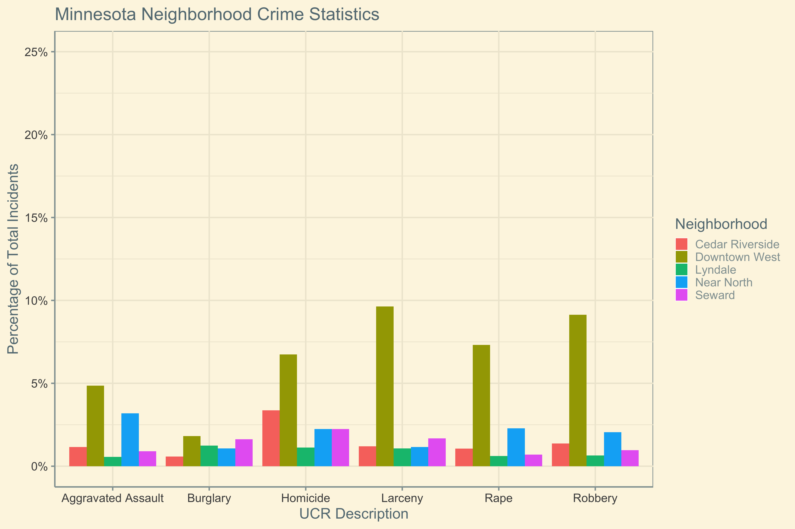

```{r, setup, include = FALSE}
#knitr::opts_knit$set(include = FALSE)
knitr::opts_knit$set(root.dir = normalizePath(".."))  # should change the working directory to 'Users/Me/Docs/Proj'
knitr::opts_knit$get("root.dir")  # returns 'Users
```


# Question 1: Wrangling and Summarization

The first step of any data analysis should be reading in the appropriate libraries and data. I like to use the fread function from the data.table package to read in large data files. First, I read in all of the libraries and datasets needed for each step of this question.

```{r message = FALSE}
####Read in Libraries####
library(data.table)
library(tidyverse) 
library(Hmisc)


####Read in Data####
police_stop_data <- fread("data-raw/police_stop_data.csv", sep = ",", header = TRUE)
police_use_of_force <- fread("data-raw/police_use_of_force.csv", sep = ",", header = TRUE)

```

## Part 1

The next step was to use tidyverse packages to create the tidy dataset alluded to in the instructions. In order to get the proper number of police force incidents, I selected three columns from the original data, $CaseNumber$, $SubjectRoleNumber$, and $ForceType$, and found the distinct rows. I then grouped by $CaseNumber$ and $SubjectRoleNumber$ in order to get a long version of the unique police force incidents. I then used the spread function so that for each police force incident, all of the force types used in each incident became new columns. As you can see at the bottom of this code chunk, the number of police force incidents in this dataset is 14,716. 

```{r message = FALSE}
####Part 1####
##Tidy Data
police_use_of_force_tidy <-
  police_use_of_force %>% 
  select(CaseNumber, SubjectRoleNumber, ForceType) %>% 
  distinct() %>%
  group_by(CaseNumber, SubjectRoleNumber) %>%
  mutate(ForceTypeNum = 1:n(), varType = "ForceType") %>%
  unite(combi, varType, ForceTypeNum) %>% 
  spread(combi, ForceType)
number_of_police_force_incidents <- nrow(police_use_of_force_tidy) 
print(paste0("Number of Police Force Incidents: ", number_of_police_force_incidents))
```

## Part 2

The first step in this part of the wrangling and summarization question is to define all of the invalid codes as defined in the instructions. As you can see in the code, I only used the three letteer abbreviations for each invalid code. Once completed, I used the separate function to create a $callDispositionCode$ column that only shows the three letter abbreviations of the $callDisposition$. I then filtered out all of the invalid codes from the dataset. 

In separating out this data into $v\_stops$ and $p\_stops$, I first which problems account for vehicle stop problems and then filtered the $valid\_stops$ dataframe on these criteria. For pedestrian stops, I filtered out all of the problems that were not in $vehicle\_stop\_problems$.

```{r message = FALSE}
####Part 2####
##Get Rid of Invalid Stops
invalid_codes <- c("GOA", "AOK", "UTL", "TOW", 
                   "SEC", "CNL", "UNF", "NOS",
                   "AQT", "FTC", "FAL")
valid_stops <-
  police_stop_data %>%
  separate(callDisposition, c("callDispositionCode", "callDispositionDescription"), sep = "-") %>%
  filter(callDispositionCode %nin% invalid_codes)

##Vehicle Stops
vehicle_stop_problems <- c("Traffic Law Enforcement (P)", "Suspicious Vehicle (P)")
v_stops <- valid_stops %>%
  filter(problem %in% vehicle_stop_problems)

##Pedestrian Stops 
p_stops <- valid_stops %>%
  filter(problem %nin% vehicle_stop_problems)
```

## Part 3

My first step in Part 3 of this question was to write a $fix\_race$ function to adjust all of the race definitions as defined in the instructions. I then used this function to adjust the race definitions for both $v\_stops$ and $p\_stops$. For both of these dataframes, I then grouped the data by race and counted stops by race. After merging these two grouped datasets by race, we have a $stops\_by\_race$ dataframe that shows both pedestrian and vehicle stops broken down by race. Once this was done, I used the $mutate$ function to calculate the percentage of each type of stop by race. 

```{r message = FALSE}
###Part 3####
##Function to Adjust Races
fix_race <- function(df){
  df[df == ""] = NA
  df$race <- gsub("East African", "Black", df$race)
  df$race <- gsub("Latino", "Latinx", df$race)
  df$race[is.na(df$race)] = "Other"
  df$race <- gsub("Other|Unknown", "Other Race", df$race)
  return(df)
}

##Vehicle and Pedestrian Stops by Race
v_stops <- fix_race(df = v_stops)
p_stops <- fix_race(df = p_stops)
v_stops_race <-
  v_stops %>%
  group_by(race) %>%
  dplyr::summarize(vehicle_stops = n())
p_stops_race <- 
  p_stops %>%
  group_by(race) %>% 
  dplyr::summarize(pedestrian_stops = n())
stops_by_race <- merge(p_stops_race, v_stops_race, by = "race", all = TRUE)

##Percentage of Stops by Race
stops_by_race <- 
  stops_by_race %>% 
  mutate(percentage_pedestrian_stops = pedestrian_stops/sum(pedestrian_stops),
         percentage_vehicle_stops = vehicle_stops/sum(vehicle_stops))
```

In order to calculate the percentage of stops where a search was conducted by race, I grouped $v\_stops$ and $p\_stops$ by $race$ and $vehicleSearch$ and then counted the number of incidents across these two columns. I then used the spread function for both datasets so that each row in each dataset corresponds to a unique race. Then, I selected $race$ and $vehicleSearch\_YES$ columns in each dataset. I then merged these datasets by race into the $search\_stops$ dataframe and then merged this dataframe with the $stops\_by\_race$ dataframe to get total stops by race and search stops by race in the same dataframe. I then used the mutate function to calculate the percentage of vehicle searches and percentage of pedestrian searches by race.

```{r message = FALSE}
##Percentage of Stops where Search Conducted by Race
search_v_stops_by_race <- 
  v_stops %>%
  group_by(race, vehicleSearch) %>%
  dplyr::summarize(count = n()) %>%
  mutate(searchType = "vehicleSearch") %>%
  unite(combi, searchType, vehicleSearch) %>%
  spread(combi, count) %>%
  select(c(race, vehicleSearch_YES))

search_p_stops_by_race <- 
  p_stops %>%
  group_by(race, personSearch) %>%
  dplyr::summarize(count = n()) %>%
  mutate(searchType = "personSearch") %>%
  unite(combi, searchType, personSearch) %>%
  spread(combi, count) %>%
  select(c(race, personSearch_YES))

search_stops <- merge(search_v_stops_by_race, search_p_stops_by_race, by = "race", all = TRUE)
stops_by_race <- merge(stops_by_race, search_stops, by = "race", all = TRUE)
stops_by_race <-
  stops_by_race %>%
  mutate(percentage_vehicle_searches = vehicleSearch_YES/vehicle_stops,
         percentage_pedestrian_searches = personSearch_YES/pedestrian_stops) %>%
  select(-c(vehicleSearch_YES, personSearch_YES))
```

In order to see how the Minneapolis population by race matches up with stops and searches, I created a $population\_survey\_data$ dataframe with the values given to me in the instructions. I then merged this data with the $stops\_by\_race$ dataframe by race. When doing the same calculation on several different columns of data, I like to use the .SDcols functionality in the data.table package. I subtracted all four metrics defined in the $metric\_cols$ vector from the corresponding $population\_percentage$ by race and then took the mean of all of these value by race. 

As you can see in the $mean\_difference\_percentage$ column in the results below, Native American and Black communities are the most disproportionately affected by stops and searches, while White communities are disproportionately unafftected. 

```{r message = FALSE}
##How does Minneapolis Population Match up with Other Metrics
population_survey_data <- data.frame(race = c("Asian", "Black", "Latinx", "Native American", "Other Race", "White"),
                                     population_percentage = c(0.06, 0.169, 0.091, 0.009, 0.047, 0.624))
stops_by_race <- merge(stops_by_race, population_survey_data, by = "race", all = TRUE)
metric_cols <- c("percentage_pedestrian_stops", "percentage_vehicle_stops",
                 "percentage_vehicle_searches", "percentage_pedestrian_searches")
stops_by_race_DT <- setDT(stops_by_race)[, paste0("diff_", metric_cols) := get("population_percentage") - .SD, .SDcols = metric_cols]
stops_by_race_DT <- stops_by_race_DT[, "mean_difference_percentage" := rowMeans(.SD), .SDcols = paste0("diff_", metric_cols)]
stops_by_race_DF <- 
  stops_by_race_DT %>%
  as.data.frame() %>%
  select(race, "mean_difference_percentage", {paste0("diff_", metric_cols)})
print(stops_by_race_DF)
  ##Subtract Stops and Searches by Population Percentage and Calculate Mean by Race
```

# Quetion 2: Data Visualization

Like in Question 1, my first step in Question 2 is to laod the appropriate libraries and data to tackle this problem. 

```{r message = FALSE}
####Read in Libraries####
library(data.table)
library(tidyverse) 
library(dplyr)
library(Hmisc)
library(ggplot2)
library(scales)
library(ggthemes)


####Read in Data####
neighborhood_crime_stats_raw <- fread("data-raw/neighborhood_crime_stats.csv", sep = ",", header = TRUE)
```

The next step in creating a proper data visualization is to prepare and clean the data. As was noted in the instructions, I filtered out Arson and Auto Theft from the UCR Descriptions and filtered the data to include only the 6 neighborhoods in which we are interested. I then grouped  the filtered data by neighboorhood and UCR Description and counted the number of crimes reported for each group. Next, I calculated the total crimes by UCR Description and merged those back into the data. Finally, I used the total crime counts by UCR Description to calculate the $crime\_percentage$ of each UCR Description by neighborhood. 

```{r message = FALSE}
##Filter Neighborhoods and UCR Description
filterNeighborhoods <- c("Cedar Riverside", "Downtown West", "Lyndale",
                         "Seward", "Near North")
neighborhood_crime_stats_raw$neighborhood <- gsub("Near - North", "Near North", neighborhood_crime_stats_raw$neighborhood)
neighborhood_crime_stats <-
  neighborhood_crime_stats_raw %>%
  filter(neighborhood %in% filterNeighborhoods) %>%
  filter(ucrDescription %nin% c("Arson", "Auto Theft"))

##Aggregate Data at Neighborhood/UCR Description Level
aggregated_neighborhood_crime_stats <- 
  neighborhood_crime_stats %>%
  group_by(neighborhood, ucrDescription) %>%
  dplyr::summarize(crime_count = sum(number, na.rm = TRUE))

##Calculate Totals by UCR
crime_count_by_ucr <-
  neighborhood_crime_stats_raw %>%
  group_by(ucrDescription) %>%
  dplyr::summarize(total_crime_count = sum(number, na.rm = TRUE))

##Merge Back into Other DF
aggregated_neighborhood_crime_stats <- merge(aggregated_neighborhood_crime_stats, crime_count_by_ucr, by = "ucrDescription", all.x = TRUE)
 
##Calculate Percentages
aggregated_neighborhood_crime_stats <-
  aggregated_neighborhood_crime_stats %>%
  mutate(crime_percentage = crime_count/total_crime_count)
```

Once the data is clean, I used the ggplot2 library to get my data visualization. Because I didn't want the y-axis to be too large for the data input, I created a $yMax$ variable to dynamically calculate what the maximum y-axis value should be based on the largest percentage given in the data. Because the largest $crime\_percentage$ value is around 10 percent, the $yMax$ value dynamically adjusts to be 0.25. 

In creating the actual visualization, I set neighborhood as the fill, UCR Description as the x-axis and crime percentage as the y-axis. I also used the $scale\_y\_continuous$ and $percent\_format$ functions from the ggplot2 and scales packages respectively to make the y-axis labels whole numbers with percentage signs. I then used $coord\_cartesian$ to set the y-axis maximum value. 

The final visualization is shown below as Figure 1.

```{r message = FALSE}
####Visualization####
##Calculate Top of Y Axis
possScales <- c(0:4)/4
maxVal <- max(aggregated_neighborhood_crime_stats$crime_percentage)
yMaxInd <- tail(which(possScales <= maxVal), 1)
yMax <- possScales[yMaxInd + 1]

##GGPlot
crime_plot <- ggplot(aggregated_neighborhood_crime_stats,
                     aes(fill = neighborhood, x = ucrDescription, y = crime_percentage)) +
  geom_bar(position = "dodge", stat = "identity") + 
  scale_y_continuous(labels = scales::percent_format(accuracy = 1)) +
  xlab("UCR Description") + ylab("Percentage of Total Incidents") + labs(fill = "Neighborhood") +
  ggtitle("Minnesota Neighborhood Crime Statistics") + coord_cartesian(ylim = c(0, yMax)) +
  theme_solarized(base_size = 20, light = TRUE)
ggsave(filename = "plots/CPE_Data_Visualization.png", crime_plot, dpi = 300, width = 15, height = 10)
```



# Question 3: Statistical Modeling

Like in the previous two questions, my first step is to load libraries and data. I decided to add one extra step here and filter out any entries with annotation errors in order to get the best picture of how race is predictive of searches  

```{r message = FALSE}
####Read in Libraries####
library(data.table)
library(tidyverse) 
library(tidymodels)
library(dplyr)
library(Hmisc)
library(ggplot2)
library(plotROC)
library(MLmetrics)


####Read in Data####
pedestrian_stops_clean <- fread("data-raw/pedestrian_stops.csv", sep = ",", header = TRUE)

##Filter Data
pedestrian_stops_clean <- 
  pedestrian_stops_clean %>%
  filter(is.na(ANNOTATION_ERRORS) == TRUE)
```

## Part 1

For this section, I decided to build a generalized linear model with a link logit function (or with a binomial family). For classification problems like this, generalized linear models with a link logit function allow for a good understanding of the relationships between predictors and the response variable. While other machine learning options like a random forest model are black boxes and make it difficult to understand the direction of certain relationships, a GLM will allow us to see if there are any relationships between race and probability of being searched.

In prepping the data for modeling, I first created a model matrix with race, gender, and searches as the inputs. Because the existing race columns of a logical type are not consistent with the cleaned definitions of race defined in the first question, I thought this would be the best approach. Initially, I also added some interaction terms between racee and gender but decided that these might make it harder to find direct relationships between race and searches conducted. I also added $Disposition$ as an additional predictor. 

Next, I split the data into a training and test set, using a proportion of 3/4. Finally, I built a GLM and step-wise GLM. As can be seen in the results of the original GLM, race does not play as important of a role in predicting searches as gender and disposition do. However, in looking at the results of the step-wise GLM, we can see that race does still have a role in predicting searches, particularly if the subject is a member of the black community or the white community. According to the coefficient estimates, black people have a significantly higher chance of being searched, while white people have a significantly lower chance of being searched. 


```{r message = FALSE}
####Part 1####
##Build Model Matrix
model_data <- 
  pedestrian_stops_clean %>%
  modelr::model_matrix( ~ SUBJECT_RACE + SUBJECT_GENDER + SEARCH_CONDUCTED) %>%
  as.data.frame() %>% 
  select(-c("(Intercept)"))
names(model_data) <- gsub("SEARCH_CONDUCTEDYES", "SEARCH_CONDUCTED", names(model_data))
model_data$Disposition <- pedestrian_stops_clean$DISPOSITION

##Train/Test Split
set.seed(321)
split <- 
  model_data %>%
  initial_split(prop = 3/4) 
training_data <- 
  split %>%
  training()
testing_data <- 
  split %>%
  testing()  

##Build GLM
pedestrian_stop_glm <- glm(SEARCH_CONDUCTED ~ ., training_data, family = "binomial")
pedestrian_stop_glm_step <- stats::step(pedestrian_stop_glm)
summary(pedestrian_stop_glm)
summary(pedestrian_stop_glm_step)

##Get Predictions
preds <- stats::predict(pedestrian_stop_glm, testing_data, type = "response")
preds_step <- stats::predict(pedestrian_stop_glm_step, testing_data, type = "response")
```

## Part 2

In order to check the validity of my models, I first need to generate model predictions for both models using my test set. Once this is done, I use these predictions to determine whether or not a search is predicted or not. If the predictions are above 50\%, then a search is predicted. Otherwise, a search is not predicted. After generating these model predictions, I stored them in the $preds_df$ dataframe.  

In testing the validity of classification models, there are several metrics that I tend to use. Firstly, I like to take a look at a confusion matrix to see a model's accuracy, sensitivity, and specificity. Depending on the scope of the problem, certain of these metrics may be emphasized over others. For this problem, specifity may hold more importance because of the value of minimizing false negatives in determing search probability. Unfortunately here, both models have almost identical confusion matrices. Additionally, while they both have strong accuracy and sensitivity, they lack in specificity. 

If confusion matrices are not helpful, other helpful metrics in determing model validity are ROC and AUC. In the below code, I used the $AUC$ function from the MLmetrics package to calculate the AUC for both models. As can be seen below, the step-wise GLM barely outperforms the original GLM according to area-under-the-curve. However, with AUC's of around 0.81, both models appear to perform relatively well.

```{r message = FALSE}
####Part 2####
##Evaluate Models
preds_df <- data.frame(observations = testing_data$SEARCH_CONDUCTED,
                       predictions = preds,
                       predictions_step = preds_step)
preds_df$predictions_classes <- ifelse(preds_df$predictions >= 0.5, 1, 0)
preds_df$predictions_step_classes <- ifelse(preds_df$predictions_step >= 0.5, 1, 0)
confusion_mat <- caret::confusionMatrix(factor(preds_df$predictions_classes), factor(preds_df$observations))
confusion_mat
confusion_mat_step <- caret::confusionMatrix(factor(preds_df$predictions_step_classes), factor(preds_df$observations))
confusion_mat_step
auc <- AUC(preds_df$predictions, preds_df$observations)
auc_step <- AUC(preds_df$predictions_step, preds_df$observations)
print(paste0("AUC for Original GLM: ", auc))
print(paste0("AUC for Step-Wise GLM: ", auc_step))
```

Because the AUC of the step-wise GLM is slightly higher, I decided to display the ROC curve of the step-wise GLM. This can be found below. 

```{r message = FALSE}
##ROC Curve
obs <- preds_df$observations
pr <- preds_df$predictions_step
ggplot(preds_df, aes(d = obs, m = pr)) + geom_roc() + style_roc()
```


# Question 4: Interpretation of Results
## Part 1
Standardizing these values is important for avoiding any bias that could be introduced into the model. For example, for $BlackPercentZ$ and $PovertyPercentZ$, census tracts with larger overall populations probably have large populations of black communities and impoverished communities. If these values are not converted into percentages based on the overall population of the census tract, it could lead to an overinflated estimate of pedesterian stops in certain census tracts. Moreover, it could introduce excessive amounts of multicollinearity in the model and lead to potentially misleading results. 

Similarly, for $part1CrimeZ$, converting this value from a counting statistics to some type of per-capita measurement will give the model a better understanding of the rate at which these crimes are committed in each census tract, which will probably be more helpful in determining the count of pedestrian stops involving people of different races. 

## Part 2
Negative binomial regression is helpful in modeling over-dispersed count data, or in other words, count data that has a larger variance than its mean. In dealing with pedestrian stop count data involving people of different races, an assumption of over-dispersion should be relatively safe to make, because pedestrian stops are *relatively* uncommon occurrences. It is important to note that this does not imply that pedestrian stops are insignificant occurrences in many communities. 

Furthermore, applying a Poisson model or any other kind of regression to over-dispersed count data can lead to understated error rates, which can in turn lead to misleading results. 

## Part 3

## Part 4
Assuming that the reference category for race is white in this model, there are between 1.3 and 1.78 less stops per census tract involving Asian people than there are involving white people. This difference of course depends on the poverty percentage of the respective census tract. I arrived at this number by adding together the coefficients for $SUBJECT\_RACEAsian$ and the interaction term between $SUBJECT\_RACEAsian$ and $PovertyPercentZ$. If the povery percent is 0, then the value is around 1.3 less stops per census tract. If the poverty percent is 100, then the value is around 1.78 less stops per census tract.

Similarly, there are between 1.85 and 2.7 stops more per census tract involving black people than there are involving whie people. Again, this difference depends on the povery percentage of the respective census tract. I arrived at this number by adding together coefficiencts for $SUBEJCT\_RACEBlack$ and the interaction term between $SUBJECT\_RACEBlack$ and $PoveryPercentZ$. If the poverty percent is 0, then the value is around 2.7 more stops per census tract. If the poverty percent is 100, then the value is around 1.85 more stops per census tract.


## Part 5
